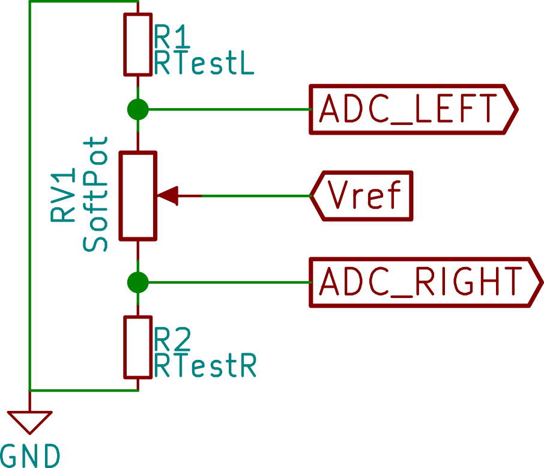

# SoftPotMagic

SoftPot multitouch (up to 2 positions) and gap measurement library for Arduino.

## Usage

### Selecting Test Resistors

Two test resistors are required in order to make the circuit working properly.
They need to be chosen specifically for the application.
The resistance of the test resistors needs to be large enough
so that the SoftPot will not overheat when one or both of the ends are touched
(creates a short circuit between the center pin and one or two side pins) and
small enough so that the voltage difference measured from SoftPot is large
enough to calculate the position.

If in doubt and the total resistance of your SoftPot is 10Kohm or 20Kohm (they
are the most common type and sold on SparkFun, Adafruit, Digikey, Mouser, etc.
for a small quantity), use test resistors with resistance of 10Kohm.

**WARNING**: Bad choice of test resistors can cause inaccurate measurement or
permanent damage to the SoftPot/Arduino.

### Wiring

Connect your SoftPot and test resistors to the Arduino as follows:

`Vref` is the reference voltage of the analog pins of your Arduino (5V pin for
5V Arduino boards and 3.3V/3V3 for 3.3V Arduino boards).

`ADC_LEFT` and `ADC_RIGHT` are the analog pins of your choice.

`R1` and `R2` are the test resistors and `RV1` is the SoftPot.

### Library

To use the library, you must initialize it first with
`SoftPotMagic.begin(<left_pin>, <right_pin>)` in the `setup()` function where
`<left_pin>` and `<right_pin>` are the analog pins of your choice.

A calibration also needs to be performed either by calling
`SoftPotMagic.autoCalibLeft()` when you
press and hold the left end of the SoftPot and `SoftPotMagic.autoCalibRight()`
for the right end, or by telling the resistance of your test resistors and the
total resistance of your SoftPot to the library by calling
`SoftPotMagic.setCalib(<RTestL>, <RTestR>, <RSoftPot>, <ADCMax>)`. (ADCMax is
the maximum value `analogRead()` can return (typically 1023 for Arduino)).
The calibration data can be backed up on a persistent storage (e.g. EEPROM).
You can get the pointer of the calibration data by using
`calib_t *calib = SoftPotMagic.getCalib()` and save it. Use
`SoftPotMagic.setCalib(calib)` to load calibration data to the library.
If your SoftPot does not report `POS_FLOAT` when not touched, you might also
want to adjust the ADC zero level by using the `SoftPotMagic.autoCalibZero()`
when not touching the SoftPot. The value obtained by this call will be stored
in the calibration data and can be fetched using `getCalib()`. You can also then
call `SoftPotMagic.autoCalibZero(false)` multiple times to get a maximum value
of ADC readings where it should be zero.

In addition to the calibration, you need to also specify the largest size of a
single point touch via `SoftPotMagic.setMinGapRatio()`, which is represented as
a float number between 0.0 and 1.0. You can calculate this value based on how
long your SoftPot is and the rough size of the thing that you use to touch the
SoftPot (e.g. finger, stylus, wiper, etc.). You can also read it back
using `SoftPotMagic.getMinGapRatio()` so that it can be stored in some permanent
storage (such as EEPROM).

Use `SoftPotMagic.update()` to get the latest update for the positions (it
should be called periodically). You can then use `SoftPotMagic.pos1()` and
`SoftPotMagic.pos2()` to get the positions. In the case of gap
measurement, use `SoftPotMagic.gapCenter()` for the center position of gap and
`SoftPotMagic.gapSize()` for the distance of it.
The returned value of these functions range from 0 (`POS_MIN`) to 254
(`POS_MAX`), 255 or `POS_FLOAT` is returned if no touch/gap was detected.

Refer to the example for more information.

## Application

- Ribbon controller that supports 2 simultaneous voices
- Resistive slider that supports basic gestures (pinch-in, pinch-out, two-finger
  drag, etc.)
- Slider controller of a [certain game][1]

## License

LGPLv3+

## Special Thanks

adzy31 for his [YouTube video][2] that makes me realize the possibility of doing
2 position touch sensing on a SoftPot.

[1]: https://en.wikipedia.org/wiki/Hatsune_Miku:_Project_DIVA_Arcade
[2]: https://www.youtube.com/watch?v=thcqCgX51BY
